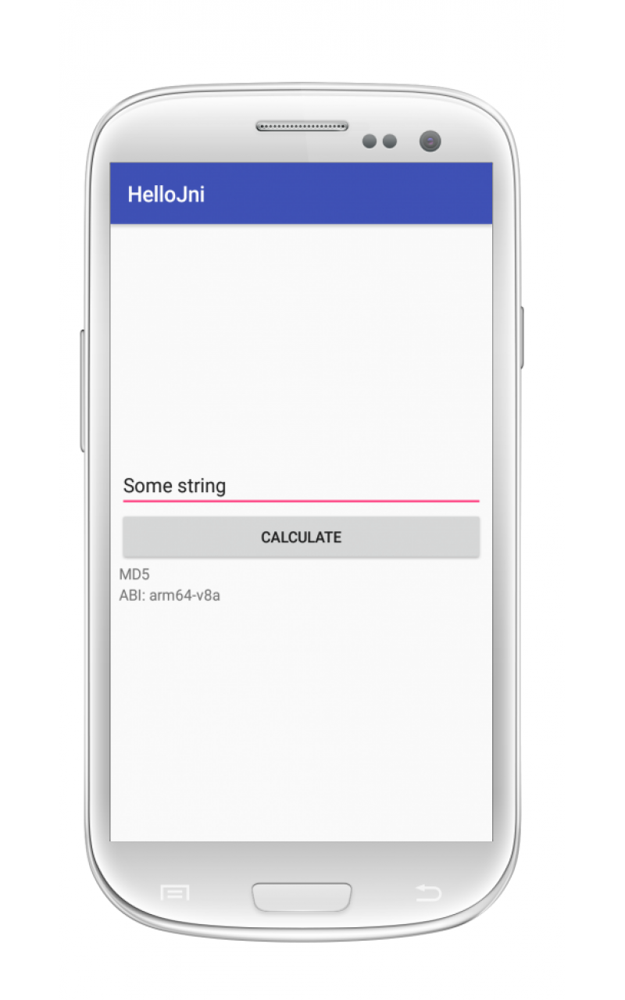
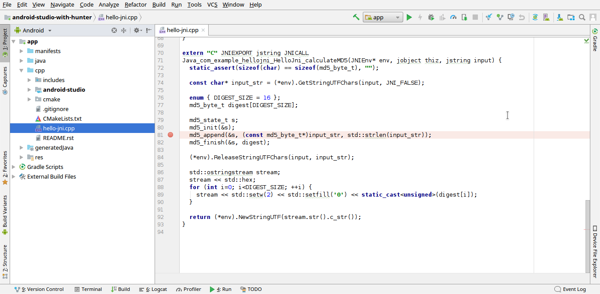
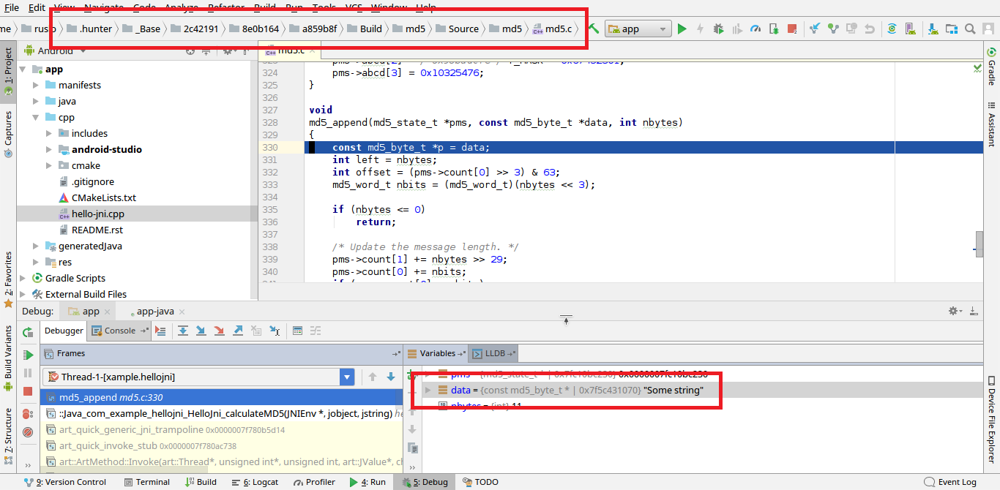

.. Copyright (c) 2018-2019, Ruslan Baratov
.. All rights reserved.

.. spelling::

  Gradle
  md

How to use Hunter in Android Studio?
------------------------------------

CMake can be used as a build tool for native C/C++ libraries in Android Studio.
If CMake project has third party dependencies these dependencies can be managed
by Hunter.

Example
=======

As an example let's take a look at a simple project with one tiny
:doc:`md5 package </packages/pkg/md5>` dependency. The project is a slight
modification of the
`HelloJni sample <https://github.com/googlesamples/android-ndk/tree/master/hello-jni>`__.

.. admonition:: Examples on GitHub

  * `Android Studio with Hunter <https://github.com/forexample/android-studio-with-hunter>`__

.. note::

  The code was tested with Android Studio: 3.3, 3.4.1, 3.5 beta 2

Check you have at least CMake 3.9.2. Such a requirement needed to work with
`Android NDK r16+ <https://gitlab.kitware.com/cmake/cmake/issues/17253>`__:

.. code-block:: none
  :emphasize-lines: 1, 3

  > cmake --version

  cmake version 3.9.2

  CMake suite maintained and supported by Kitware (kitware.com/cmake).

Check you have Ninja build tool installed:

.. code-block:: none

  > which ninja
  /usr/bin/ninja

You can use your system package manager
(e.g., on Ubuntu do ``sudo apt-get install ninja-build``)
or download it from GitHub releases, unpack and add to ``PATH``:

* https://github.com/ninja-build/ninja/releases

Get the sources:

.. code-block:: none
  :emphasize-lines: 1

  > git clone https://github.com/forexample/android-studio-with-hunter
  > cd android-studio-with-hunter
  [android-studio-with-hunter]>

Android Studio project configuration files reside in the ``android-studio``
directory but before opening it you have to create the ``local.properties`` file
and add the ``cmake.dir`` entry there.

.. seealso::

  * `Android Studio: Use CMake 3.7 or higher <https://developer.android.com/studio/projects/add-native-code#vanilla_cmake>`__

You may want to add the paths to Android NDK/SDK as well (if ``ndk.dir`` and
``sdk.dir`` not present in ``local.properties`` then they will be set by
Android Studio to default locations):

.. code-block:: none
  :emphasize-lines: 6

  [android-studio-with-hunter]> cd android-studio
  [android-studio-with-hunter/android-studio]> cat local.properties

  ndk.dir=/home/your/path/to/android-sdk/ndk-bundle
  sdk.dir=/home/your/path/to/android-sdk
  cmake.dir=/home/your/path/to/cmake

.. hint::

  Since ``local.properties`` contains information about a local machine
  you should add it to
  `.gitignore <https://github.com/forexample/android-studio-with-hunter/blob/2639b6732a0d4ffe7608839c60911cc3364b4ca0/.gitignore#L20-L21>`__.

.. warning::

  Android NDK r19+ is :ref:`not supported <android ndk r19>`. You **have to**
  switch to a lower version explicitly, e.g. to NDK r18b.

Please check that ``cmake.dir`` has such value that ``<cmake.dir>/bin/cmake``
executable exists.

At this moment you can launch Android Studio and open your project but
note that Gradle will start configuring, it will trigger CMake configuration
which will trigger Hunter builds for 3 architectures:

.. code-block:: none
  :emphasize-lines: 11

  [android-studio-with-hunter/android-studio]> cat app/build.gradle

  android {
      ...
      defaultConfig {
          ...
          abi {
              enable true

              reset()
              include 'x86_64', 'armeabi-v7a', 'arm64-v8a'

              universalApk false
          }
      }
      ...
  }

As an alternative, you are able to build one architecture at a
time using ``-Parch=``:

.. code-block:: none
  :emphasize-lines: 1

  [android-studio-with-hunter/android-studio]> ./gradlew asDebug -Parch=arm64-v8a

  > Task :app:externalNativeBuildDebug
  Build hello-jni arm64-v8a
  [1/2] Building CXX object CMakeFiles/hello-jni.dir/hello-jni.cpp.o
  [2/2] Linking CXX shared library ../../../../build/intermediates/cmake/debug/obj/arm64-v8a/libhello-jni.so

  BUILD SUCCESSFUL in 4s
  30 actionable tasks: 2 executed, 28 up-to-date

CMake binary directory will be set to
``app/.externalNativeBuild/cmake/debug/arm64-v8a/``, you can find CMake logs
there:

.. code-block:: none

  [android-studio-with-hunter/android-studio]> grep 'Hunter-ID' app/.externalNativeBuild/cmake/debug/arm64-v8a/cmake_build_output.txt

  [hunter] [ Hunter-ID: 4959eb9 | Toolchain-ID: 8e0b164 | Config-ID: 48b836e ]

Or even start CMake build without using Gradle:

.. code-block:: none
  :emphasize-lines: 2

  [android-studio-with-hunter/android-studio]> touch ../CMakeLists.txt
  [android-studio-with-hunter/android-studio]> cmake --build app/.externalNativeBuild/cmake/debug/arm64-v8a
  [1/1] Re-running CMake...
  -- [hunter *** DEBUG *** 2018-07-25T19:52:14] HUNTER_ROOT set using HOME environment variable
  ...
  -- [hunter] [ Hunter-ID: 4959eb9 | Toolchain-ID: 8e0b164 | Config-ID: 48b836e ]
  ...
  -- Configuring done
  -- Generating done
  -- Build files have been written to: /.../android-studio-with-hunter/android-studio/app/.externalNativeBuild/cmake/debug/arm64-v8a
  [1/1] Linking CXX shared library ../../../../build/intermediates/cmake/debug/obj/arm64-v8a/libhello-jni.so

Issues
======

Detached CMake
~~~~~~~~~~~~~~

If Gradle build fails the underlying CMake process will **keep running**.

.. code-block:: none

  > ./gradlew assembleDebug -Parch=armeabi-v7a
  ...

      * What went wrong:
      Execution failed for task ':app:generateJsonModelDebug'.
      > Format specifier '%s'

CMake is active:

.. code-block:: none

  > ps aux | grep cmake

  ... cmake -E server --experimental --debug
  ... cmake --build /.../__HUNTER/_Base/87420eb/2e091e5/84f821a/Build/OpenCV/Build
  ... cmake -E touch /.../__HUNTER/_Base/87420eb/2e091e5/84f821a/Build/OpenCV/Build/OpenCV-Release-prefix/src/OpenCV-Release-stamp/OpenCV-Release-download
  ... cmake -P /.../__HUNTER/_Base/87420eb/2e091e5/84f821a/Build/OpenCV/Build/OpenCV-Release-prefix/src/OpenCV-Release-stamp/download-OpenCV-Release.cmake

Internal files locked:

.. code-block:: none

  > lslocks | grep cmake.lock

  cmake ... /.../__HUNTER/_Base/Download/OpenCV/4.0.0-p0/90680ea/cmake.lock
  cmake ... /.../__HUNTER/_Base/87420eb/2e091e5/84f821a/cmake.lock

You **should not** run Gradle build again, wait for CMake job to finish
or force it to stop (e.g., ``kill -9``).

See issues:

- https://issuetracker.google.com/issues/123895238
- https://issuetracker.google.com/issues/75268076

No CMake files
~~~~~~~~~~~~~~

Not all CMake files necessary for the build will be created if the initial
configure step will fail. In this case, you can add ``return()`` command
right **after the first hunter_add_package** call (this is where initialization
is happening and all ``*-ID`` calculated) to mimic successful CMake
configure step:

.. code-block:: cmake
  :emphasize-lines: 3

  # ...
  hunter_add_package(md5)
  return() # Early exit

Run Gradle again:

.. code-block:: none

  [android-studio-with-hunter/android-studio]> ./gradlew asDebug -Parch=arm64-v8a

Remove ``return()`` from CMake code, now you will be able to run CMake:

.. code-block:: none

  [android-studio-with-hunter/android-studio]> cmake --build app/.externalNativeBuild/cmake/debug/arm64-v8a

Example of how it can be done in a continuous integration build:

- `CMakeLists.txt <https://github.com/elucideye/drishti/blob/7001ac0f6e8e5f9a04a8eae70274a613a13ce96b/CMakeLists.txt#L108-L113>`__
- `Testing script <https://github.com/elucideye/drishti/blob/7001ac0f6e8e5f9a04a8eae70274a613a13ce96b/bin/jenkins.sh#L203-L226>`__

.. _android ndk r19:

Android NDK r19+
~~~~~~~~~~~~~~~~

Android NDK r19 is not supported by built-in CMake modules
(which is a requirement). The workaround is to download and use Android
NDK r18 or lower:

- https://developer.android.com/ndk/downloads/older_releases.html

and add path to NDK to ``local.properties``:

.. code-block:: none
  :emphasize-lines: 1

  ndk.dir=/home/your/path/to/android-ndk-r18
  sdk.dir=/home/your/path/to/android-sdk
  cmake.dir=/home/your/path/to/cmake

.. seealso::

  - https://gitlab.kitware.com/cmake/cmake/issues/18739
  - https://gitlab.kitware.com/cmake/cmake/issues/18787

Project
=======

Open Android Studio project, connect your device and click
``Run 'app' (Shift + F10)``. You should see ``HelloJni`` based application
started:

If you take a look at ``CMakeLists.txt`` of the project you will find
the option for keeping third party sources:

.. code-block:: cmake

  option(HUNTER_KEEP_PACKAGE_SOURCES "Keep third party sources" ON)

.. warning::

  Please make sure to read documentation about
  :ref:`HUNTER_KEEP_PACKAGE_SOURCES <hunter keep package sources>`
  before adding it to your project.

It means that debugger can be used to step into md5 package source code.
Open ``hello-jni.cpp`` file and set the breakpoint to ``md5_append`` call:

Click ``Debug 'app' (Shift + F9)`` to run an application in Debug mode.
After the application started click ``CALCULATE`` button on the device.
When debugger will reach ``md5_append`` call click ``Step Into (F7)``.
As you can see debugger stepped into the ``md5.c`` source code of third party
md5 package and "data" with value "Some string" passed to "md5_append" function:

Integration
===========

Here is a description of the integration approach.

:doc:`CMake toolchain file </overview/customization/toolchain-id>` used to
customize third party packages builds in Hunter. And since Android Studio
provides it's own toolchain for a build such action do introduce a little quirk.
Some of the variables like ``ANDROID_ABI`` was read from a command line and is
not part of the toolchain, hence Hunter will not forward them to third parties.
A user also may want to add extra settings to the toolchain. And one more problem is
that variables provided by Android Studio toolchain little bit differ from
ones expected by a project that relies on ``CMAKE_ANDROID_*`` conventions
(introduced in CMake 3.7).

As a workaround for all the issues above, we can inject our own toolchain with
``FORCE``.

Add extra CMake argument to ``build.gradle`` configuration:

.. code-block:: none
  :emphasize-lines: 4-6

  externalNativeBuild {
      cmake {
          arguments '-DANDROID_STL=c++_static',
              // Extra custom variable to
              // trigger workaround code.
              '-DHELLOJNI_ANDROID_STUDIO=1'
      }
  }

.. note::

  Please name this variable next to your project to avoid clashes with
  other projects that can be added by ``add_subdirectory``.

Use this variable for triggering CMake workaround code, note that toolchain
should be set **before** first ``project`` command:

.. code-block:: cmake

  if(HELLOJNI_ANDROID_STUDIO)
    set(gen_toolchain "${CMAKE_CURRENT_BINARY_DIR}/generated/toolchain.cmake")
    configure_file(
        "${CMAKE_CURRENT_LIST_DIR}/cmake/template/toolchain.cmake.in"
        "${gen_toolchain}"
        @ONLY
    )
    set(CMAKE_TOOLCHAIN_FILE "${gen_toolchain}" CACHE PATH "" FORCE)
  endif()

  # ...

  project(...)

The content of the latest ``toolchain.cmake.in`` template can be found here:

* https://github.com/forexample/android-studio-with-hunter/blob/master/cmake/template/toolchain.cmake.in
