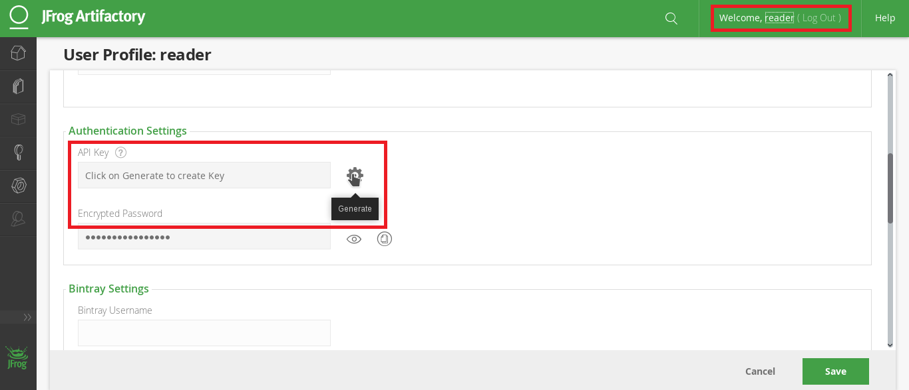

.. Copyright (c) 2018, Ruslan Baratov
.. All rights reserved.

.. spelling::

    Artifactory

Using Artifactory as binary cache server
----------------------------------------

It is possible to use ``Artifactory`` as a binary cache server.

* https://jfrog.com/artifactory/

Start and prepare
=================

As an example it will be shown how to start Artifactory on local machine
from Docker.

Pull and start docker image, forward port 8081:

.. code-block:: none

  > docker run -it -p 8081:8081 docker.bintray.io/jfrog/artifactory-oss bash

Open URL http://localhost:8081 in browser and use default login
``admin``/``password`` to enter.

We will use key-based access to binaries without any anonymous reads so
let's remove default permission. Go to ``Admin`` -> ``Permissions``:

And remove everything:

Create ``Local repository``:

And choose type ``Generic``:

Name it ``hunter`` and click ``Save & Finish``:

Next let's create user ``reader`` who will have ``Read`` access and
user ``writer`` who will have ``Deploy/Cache`` access.

Click ``Add User``:

Enter ``reader`` name and password, click ``Save`` :

Login as ``reader``, go to ``Profile`` and generate API Key:

Save this key, further it will be referenced as ``artifactory_reader_key``.

Do the same for ``writer`` user, writer's key will be referenced
as ``artifactory_writer_key``.

Login as ``admin`` to give permissions for users:

Name it ``Hunter access`` and add ``hunter`` to repositories:

Go to ``Users`` tab and add ``reader``/``writer``. Give
``reader`` access of type ``Read``. Give ``writer`` user access or type
``Deploy/Cache``:

.. note::

  In real example you will create account with upload access that can do
  both ``Read`` and ``Deploy/Cache``.

CMake code
==========

Set :ref:`HUNTER_CACHE_SERVERS <hunter_cache_servers>`
variable before ``HunterGate`` to configure ``Hunter`` to use ``Artifactory`` server:

.. code-block:: cmake
  :emphasize-lines: 4-5

  cmake_minimum_required(VERSION 3.2)

  set(
      HUNTER_CACHE_SERVERS
      "http://localhost:8081/artifactory/hunter"
      CACHE
      STRING
      "Default cache server"
  )

  option(HUNTER_RUN_UPLOAD "Upload cache binaries" ON)

  set(
      HUNTER_PASSWORDS_PATH
      "${CMAKE_CURRENT_LIST_DIR}/cmake/Hunter/passwords.cmake"
      CACHE
      FILEPATH
      "Hunter passwords"
  )

  include(cmake/HunterGate.cmake)
  HunterGate(URL "..." SHA1 "...")

  project(foo)

  hunter_add_package(PNG)

Artifactory keys can be set by ``HTTPHEADER`` in
:doc:`Hunter passwords file </reference/terminology/hunter-passwords-file>`:

.. code-block:: cmake
  :emphasize-lines: 8, 14

  set(artifactory_reader_key "...")
  set(artifactory_writer_key "...")

  set(server "http://localhost:8081/artifactory/hunter")

  hunter_cache_server_password(
      SERVER "${server}"
      HTTPHEADER "X-JFrog-Art-Api: ${artifactory_reader_key}"
      SUB_SHA1_SUFFIX
  )

  hunter_upload_password(
      SERVER "${server}"
      HTTPHEADER "X-JFrog-Art-Api: ${artifactory_writer_key}"
      SUB_SHA1_SUFFIX
  )

.. note::

  Artifactory treats URLs like
  ``https://my.server.com/.../file.txt.sha1`` as a special URL to get SHA1 hash
  of file ``https://my.server.com/.../file.txt``. Use ``SUB_SHA1_SUFFIX``
  to download all internal Hunter cache meta files of form ``abc.sha1``
  by using ``abc_sha1`` URL.

.. note::

  ``http://localhost:8081`` repeated 3 times, that may looks redundant
  but in general ``HUNTER_CACHE_SERVERS`` is a list, hence there may be
  several different servers used. For each server there may be one
  ``hunter_cache_server_password(SERVER ...)`` command. Server
  from ``hunter_upload_password`` may not be in ``HUNTER_CACHE_SERVERS`` list
  at all, though it might not make a lot of sense.

Run CMake build. After build finished update page and check the state of
``hunter`` repository:

Effectively it's the same as local :ref:`Cache layout <layout deployed cache>`.
