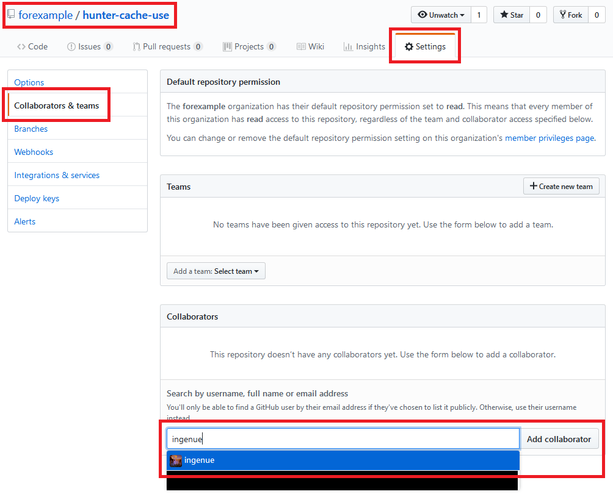
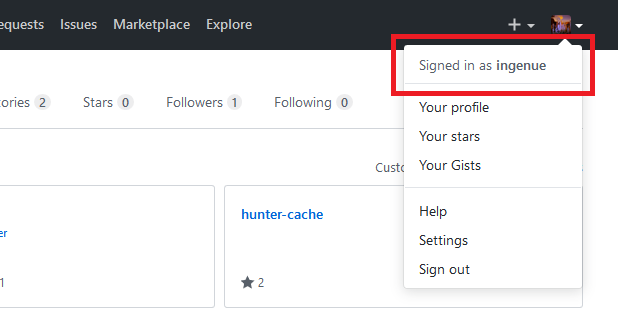
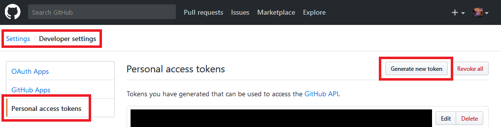
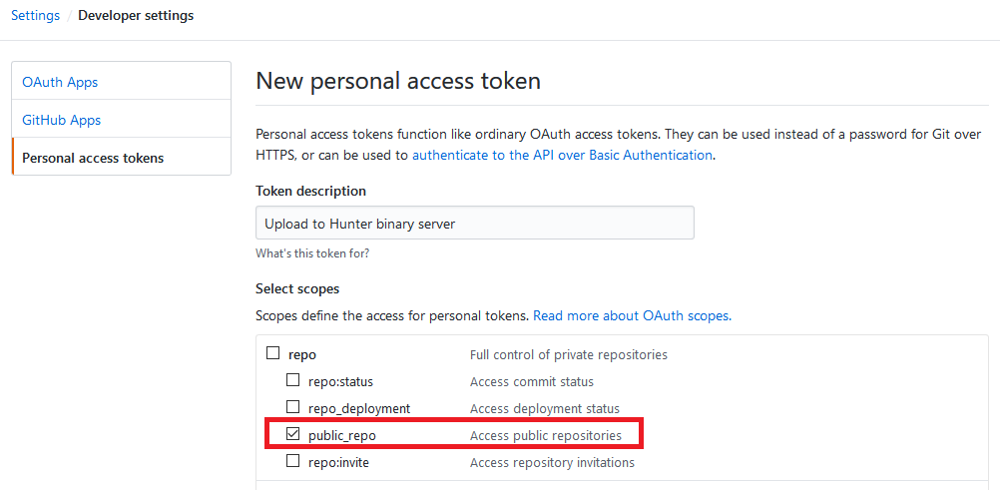
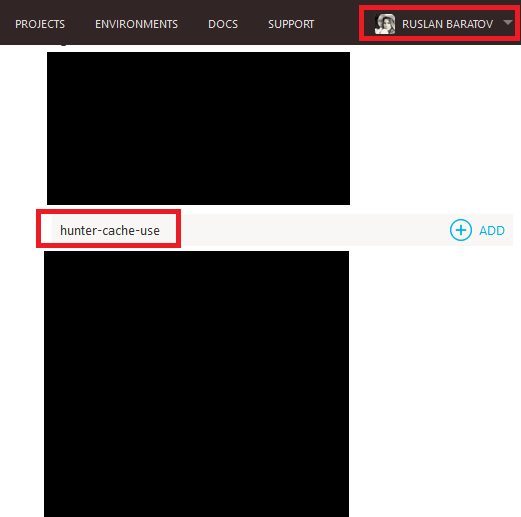
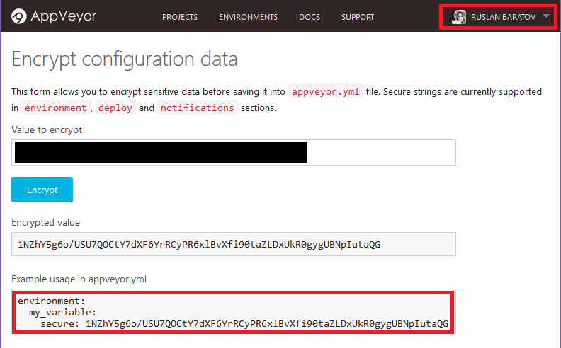

.. Copyright (c) 2016-2018, Ruslan Baratov
.. All rights reserved.

.. _uploading to server:

Using GitHub repository as binary cache server
----------------------------------------------

It is possible to upload Hunter binary cache to the server.
Next shown an example of using GitHub as a hosting. All big raw ``*.tar.bz2`` archives
uploaded as assets to release with names ``cache-*`` (directory layout does not
matter) and all small text files with meta information uploaded directly to
branch ``master`` (directory layout matters) (see
`hunter-cache <https://github.com/ingenue/hunter-cache>`__ as example).

.. note::

  If you have shared folder in your network there is no need to use
  any scripts, you can just set ``HUNTER_ROOT`` variable to location of this
  directory.

.. note::

  Currently upload procedure is implemented using Python script with
  ``requests`` module, check that you have Python installed in your system.
  This limitation will be removed in future. Downloading from server done by
  ``file(DOWNLOAD ...)`` CMake commands, so client is still CMake-only based.

List of servers that will be used for downloading binaries can be set in
:ref:`HUNTER_CACHE_SERVERS <hunter_cache_servers>` variable.

If you want to check that there is no 3rd party builds triggered by CMake and
all packages downloaded from server you can use
:ref:`HUNTER_DISABLE_BUILDS <hunter_disable_builds>` variable. Also variable
:ref:`HUNTER_USE_CACHE_SERVERS <hunter_use_cache_servers>` can be used to specify
downloading policy.

Uploading parameters can be set using
:ref:`hunter_upload_password <hunter_upload_password>` module in
:doc:`Hunter passwords file </reference/terminology/hunter-passwords-file>`.

Use :ref:`HUNTER_RUN_UPLOAD=YES <hunter_run_upload>` option to start upload
procedure.

Example
~~~~~~~

Next example will show how to setup GitHub binary cache server:

* https://github.com/forexample/hunter-cache

Which will be managed by bot account:

* https://github.com/ingenue

Cache will be uploaded for CI jobs in repository:

* https://github.com/forexample/hunter-cache-use

Any other repository can use https://github.com/forexample/hunter-cache too.

Access
~~~~~~

Add ``ingenue`` bot as a collaborator to both ``hunter-cache`` and
``hunter-cache-use``:

GitHub token
~~~~~~~~~~~~

Let's generate GitHub token which will be used for upload. Login
to GitHub with the **bot** account, in our case it's ``ingenue``:

:menuselection:`Settings --> Developer settings --> Personal access tokens --> Generate new token`:

Set ``public_repo`` check-box and create token:

.. note::

  Keep you token private! It's the same as your password!

.. seealso::

  * `GitHub: creating token <https://help.github.com/articles/creating-an-access-token-for-command-line-use/>`__

Now we will save this token as a secured environment variable
``GITHUB_USER_PASSWORD`` in Travis and AppVeyor.

Travis CI
~~~~~~~~~

.. note::

  Visit https://travis-ci.org and register ``hunter-cache-use`` repository
  there.

Excerpts from documentation (`1 <https://docs.travis-ci.com/user/encryption-keys>`__
and `2 <https://docs.travis-ci.com/user/environment-variables/#Encrypted-Variables>`__)
for OS X  (see also `this repo <https://github.com/forexample/github-binary-release>`__):

.. code-block:: none

  > gem install travis # for Ubuntu it will be 'sudo gem install travis'

If you have problems with installing ``travis`` try to install
`ruby from brew <http://stackoverflow.com/questions/31972968/cant-install-gems-on-os-x-el-capitan>`__:

.. code-block:: none

  > brew install ruby

Clone the repository **from where** upload will be triggered. In our case it's
https://github.com/forexample/hunter-cache-use :

.. code-block:: none

  > git clone https://github.com/forexample/hunter-cache-use
  > cd hunter-cache-use/
  [hunter-cache-use]> travis login --pro # in case repository is private

Check that login user is correct, in our case it should be **bot** account
``ingenue``:

.. code-block:: none

  [hunter-cache-use]> travis whoami
  You are ingenue

Encrypt token:

.. code-block:: none

  > travis encrypt GITHUB_USER_PASSWORD=62xxxxxx2e
  Please add the following to your .travis.yml file:

    secure: "OVGj469eTxxxxxxG+3XtqcX+790Y="

And add it to ``.travis.yml``:

.. code-block:: yaml

  env:
    global:
      - secure: "OVGj469eTxxxxxxG+3XtqcX+790Y="

.. seealso::

  * `.travis.yml example <https://github.com/forexample/hunter-cache-use/blob/d4cd989dc7601abfe2d73aeeb7f5da1b883959c3/.travis.yml#L22-L24>`__

AppVeyor
~~~~~~~~

.. note::

  Visit https://appveyor.com and register ``hunter-cache-use`` repository
  there.

.. note::

  You may want to turn on feature:

  * ``Enable secure variables in Pull Requests from the same repository only``

Login to AppVeyor as an **owner** of repository. E.g. I have registered
``hunter-cache-use`` repository with my ``ruslo`` account:

While being logged in with the same account use
`this form <https://ci.appveyor.com/tools/encrypt>`__ to encrypt bot token:

Add it to the ``appveyor.yml``:

.. code-block:: yaml

  environment:
    global:
      GITHUB_USER_PASSWORD:
        secure: 1NZhYxxxxxxIutaQG

.. seealso::

  * `appveyor.yml example <https://github.com/forexample/hunter-cache-use/blob/d4cd989dc7601abfe2d73aeeb7f5da1b883959c3/appveyor.yml#L3-L6>`__

CMake code
~~~~~~~~~~

CI systems are ready, now let's do CMake code.

.. note::

  CMake variables for Hunter should be set to cache before HunterGate, see

  * :doc:`Hunter: User variables </reference/user-variables>`

:ref:`HUNTER_CACHE_SERVERS <hunter_cache_servers>` is a list of servers we will
use to **download** binaries. We need only one server
``https://github.com/forexample/hunter-cache``:

.. code-block:: cmake
  :emphasize-lines: 2-3

  set(
      HUNTER_CACHE_SERVERS
      "https://github.com/forexample/hunter-cache"
      CACHE
      STRING
      "Default cache server"
  )

We want :ref:`HUNTER_RUN_UPLOAD <hunter_run_upload>` to be set to ``ON`` by
default only when it's a CI server and secured variable
``GITHUB_USER_PASSWORD``
is defined. In practice it means:

* Upload will be triggered when new commit pushed to branch
* Upload will be triggered when pull request opened basing on branch
  **of the same repository**
* Upload will not be available when pull request opened basing on branch
  from **another repository**
* If ``GITHUB_USER_PASSWORD`` environment variable defined on local machine
  there will be no upload by default
* If ``GITHUB_USER_PASSWORD`` environment variable defined on local machine
  and ``HUNTER_RUN_UPLOAD=ON`` **added by user** upload will happen

.. code-block:: cmake
  :emphasize-lines: 6

  string(COMPARE EQUAL "$ENV{TRAVIS}" "true" is_travis)
  string(COMPARE EQUAL "$ENV{APPVEYOR}" "True" is_appveyor)
  string(COMPARE EQUAL "$ENV{GITHUB_USER_PASSWORD}" "" password_is_empty)

  if((is_travis OR is_appveyor) AND NOT password_is_empty)
    option(HUNTER_RUN_UPLOAD "Upload cache binaries" ON)
  endif()

File with passwords:

.. code-block:: cmake
  :emphasize-lines: 3

  set(
      HUNTER_PASSWORDS_PATH
      "${CMAKE_CURRENT_LIST_DIR}/cmake/Hunter/passwords.cmake"
      CACHE
      FILEPATH
      "Hunter passwords"
  )

There will be no real passwords there, only configuration
for repositories and instruction to read password from environment variable
``GITHUB_USER_PASSWORD``:

.. code-block:: cmake
  :emphasize-lines: 5-6, 9, 12

  # cmake/Hunter/passwords.cmake

  hunter_upload_password(
      # REPO_OWNER + REPO = https://github.com/forexample/hunter-cache
      REPO_OWNER "forexample"
      REPO "hunter-cache"

      # USERNAME = https://github.com/ingenue
      USERNAME "ingenue"

      # PASSWORD = GitHub token saved as a secure environment variable
      PASSWORD "$ENV{GITHUB_USER_PASSWORD}"
  )

Full project available here:

* https://github.com/forexample/hunter-cache-use

.. seealso::

  * :doc:`F.A.Q.: Why binaries from server not used? </faq/why-binaries-from-server-not-used>`
