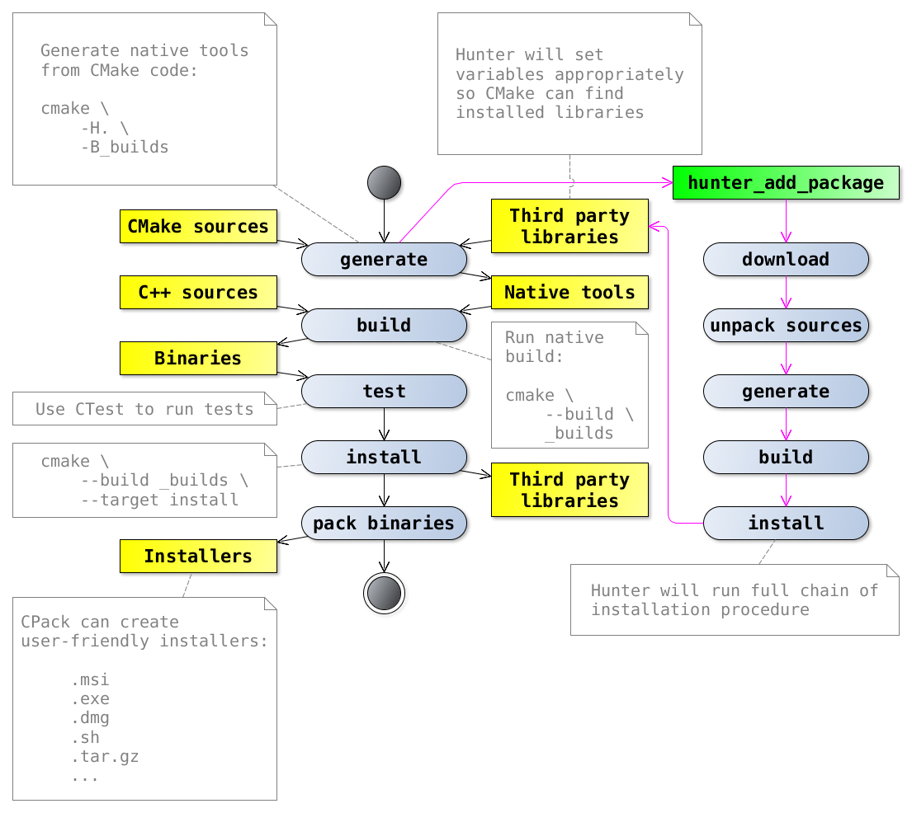

.. Copyright (c) 2016, Ruslan Baratov
.. All rights reserved.

Regular user
------------

How does Hunter affect end users which do usually run ``*.msi`` or ``*.dmg``
installers?  The answer - it doesn't at all. Hunter in fact do quite the same
stuff that developer do with packages: download, build, install, reuse in other
projects.  There will be no new functionality introduced by package - it will
be installed in the same way as system package manager or custom build script do.
But giving you much more control and allow you experimenting seamlessly. From
some point of view Hunter is like adding unit-testing to your project. It's
the tool that will not extend final behavior of application directly.
However just like with unit-testing users will probably notice result effect
such as stability/quality in overall.

Hunter in CMake environment
===========================

Here is an `activity diagram`_ showing the location of Hunter in regular
`CMake tools environment`_:

.. _activity diagram: http://yed-uml.readthedocs.io/en/latest/activity-diagram.html
.. _CMake tools environment: http://cgold.readthedocs.io/en/latest/overview/cmake-can.html#family-of-tools
